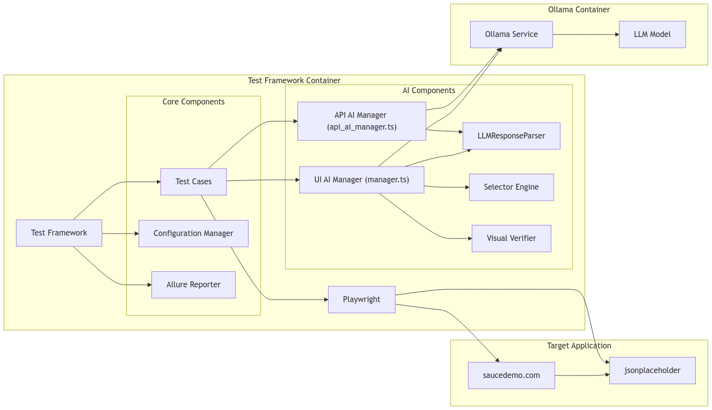

# Bennu

# Overview
Project Bennu is designed to help developers and QA engineers achieve smarter, more robust testing through AI-enhanced automation. Its modular architecture allows for:

Dynamic Test Generation: LLMs generate test data and scenarios, including negative cases and edge conditions.
UI and API Testing: The framework supports comprehensive testing for both user interfaces (via Playwright) and backend APIs.
Visual Verification: Automated visual state verification assists in confirming UI correctness.
Extensible Architecture: Easily integrate new modules or testing strategies as your application evolves.

# Architecture


# Project Structure
```
ai-enhanced-testing-framework/
├── README.md
├── package.json
├── tsconfig.json
├── docker/
│   ├── framework/
│   │   └── Dockerfile
│   └── ollama/
│       └── Dockerfile
├── src/
│   ├── config/
│   │   ├── playwright.config.ts       # Playwright configuration
│   │   ├── ai.config.ts               # AI/LLM configuration (prompt templates, model params)
│   │   └── environment.config.ts      # Environment variables and endpoints
│   ├── core/
│   │   ├── types/
│   │   │   ├── api.types.ts          # JSONPlaceholder API types
│   │   │   └── index.ts              # Common type definitions
│   │   └── utils/
│   │       ├── api.utils.ts          # API testing utilities
│   │       └── test.utils.ts         # Common test utilities
│   ├── ai/
│   │   ├── llm_response_parser.ts     # Central module for cleaning & parsing LLM outputs
│   │   ├── manager.ts                 # UI AI Manager (fallback locators, chunk-based analysis)
│   │   ├── api_ai_manager.ts          # API AI Manager (test data generation, negative scenarios)
│   │   ├── selector-engine.ts         # Dynamic selector generation
│   │   └── visual-verifier.ts         # Visual state verification
│   ├── tests/
│   │   ├── api/
│   │   │   ├── specs/
│   │   │   │   ├── posts.spec.ts      # JSONPlaceholder posts tests
│   │   │   │   ├── error.spec.ts      # Error scenario tests
│   │   │   │   └── ai_posts.spec.ts   # AI-based API tests (data gen & negative scenarios)
│   │   │   └── helpers/
│   │   │       └── api.helper.ts      # API test helpers
│   │   └── ui/
│   │       ├── pages/
│   │       │   ├── login.page.ts      # Sauce Demo login page
│   │       │   └── inventory.page.ts  # Sauce Demo inventory page
│   │       └── specs/
│   │           ├── login.spec.ts      # Login test cases
│   │           ├── inventory.spec.ts  # Inventory test cases
│   │           ├── ai_inventory.spec.ts # AI-Enhanced Inventory tests
│   │           └── ...
│   └── reporters/
│       └── allure-config.ts           # Allure configuration
├── test-results/                      
│   └── allure-results/                # Test execution outputs
└── docs/
    ├── setup.md                       # Setup instructions
```

### Reporting
- **Allure Configuration** (`src/reporters/allure-config.ts`): Integrates Allure to produce detailed, human-readable test execution reports.

## Setup and Installation

For detailed setup instructions, please refer to the [`docs/setup.md`](docs/setup.md) file.

3. **Configure Environment Variables:**

Create a .env file in the root directory. Use the sample or guidelines provided in src/config/environment.config.ts.

4. **Docker Setup (Optional):**

Use the Dockerfiles located in docker/framework/ and docker/ollama/ to build containerized versions of the framework for isolated environments.

> **Note:** I have not tested the docker implementation

## Key Modules & local execution options

### Configuration
- **Playwright Configuration** (`src/config/playwright.config.ts`): Contains settings to run Playwright tests, including browser options and test runner configurations.
- **AI Configuration** (`src/config/ai.config.ts`): Defines LLM prompt templates, model parameters, and integration endpoints for generating and processing test cases.
- **Environment Configuration** (`src/config/environment.config.ts`): Centralizes environment variables and endpoints required for both UI and API testing.

### Core Utilities
- **Type Definitions** (`src/core/types/`): Provides TypeScript definitions for APIs (e.g., JSONPlaceholder) and common application types to ensure type safety.
- **Utility Functions** (`src/core/utils/`): Houses helper methods for API calls and test operations that are reused across different modules.

### AI Integration
- **LLM Response Parser** (`src/ai/llm_response_parser.ts`): Cleans and standardizes responses from the LLM, making them ready for test execution.

> **Note:** This was the most painful and time consuming part of the project. Research on switching to a larger, better model, curation and fine tuning of the prompts for future consideration

- **UI and API AI Managers** (`src/ai/manager.ts` & `src/ai/api_ai_manager.ts`): Generate test cases dynamically by analyzing UI elements or API endpoints, including support for negative scenario generation.
- **Dynamic Selector Engine** (`src/ai/selector-engine.ts`): Creates robust UI selectors on the fly, improving test resilience against UI changes.
- **Visual Verification** (`src/ai/visual-verifier.ts`): Ensures that the UI’s visual state meets expected standards during test execution.

### Tests

- **API Tests**: 
> **Note:** These tests target the https://jsonplaceholder.typicode.com/ to demonstrate backend service testing.

Located under `src/tests/api/`, these include specifications for standard scenarios (e.g., `posts.spec.ts`), error handling (e.g., `error.spec.ts`), and AI-generated test cases (e.g., `ai_posts.spec.ts`). Additional helper functions for API tests are provided in `src/tests/api/helpers/api.helper.ts`.

- **Local ai enhanced api test run**
    ```bash
    npm run test:api:ai:report
    ```

- **UI Tests**: 
> **Note:** Tests tests target the https://www.saucedemo.com/ web interface to demonstrate front end web interface testing.

Found under `src/tests/ui/`, the framework uses a Page Object Model approach:
  - **Pages**: Defined in `src/tests/ui/pages/` (e.g., `login.page.ts`, `inventory.page.ts`).
  - **Specifications**: Test cases in `src/tests/ui/specs/` cover scenarios such as login, inventory verification, and AI-enhanced UI validations (e.g., `ai_inventory.spec.ts`).

- **Local ai enhanced ui test run**
    
    ```bash
    npm run test:ui:ai:report
    ```

- **Local all tests run**

    ```bash
    npm run test:all:report
    ```
